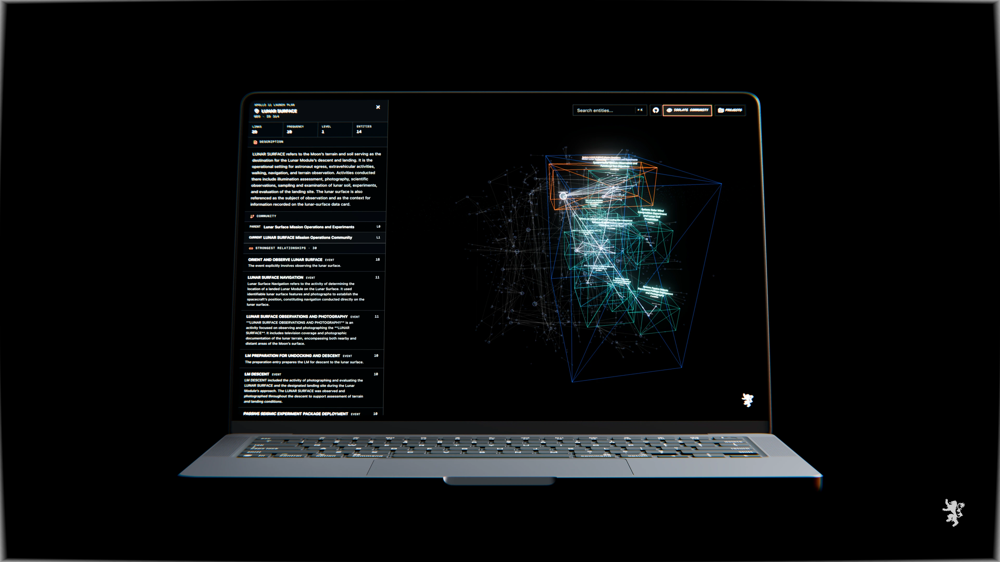
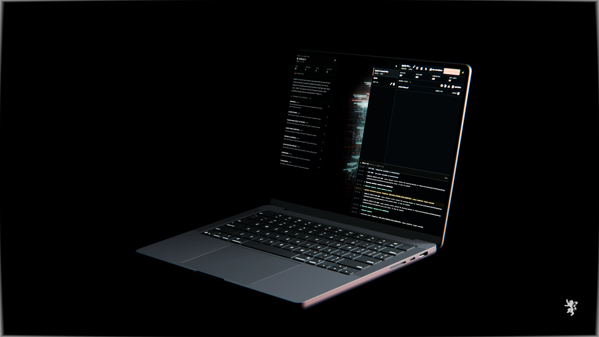

<p align="center">
  
</p>

# GraphRAG Workbench

A local workbench for turning documents into an inspectable 3D knowledge graph.

GraphRAG Workbench wraps [Microsoft GraphRAG](https://github.com/microsoft/graphrag) with local document preparation, indexing controls, a live terminal, project management, and the original Three.js graph. It is a dedicated open-source desktop-style web app: clone it, run it, and configure local or cloud models inside the Builder.

https://github.com/user-attachments/assets/1f588a45-07ca-4953-92ed-fc888fe28cff

## Version 2.0



*Inspect entity evidence, community hierarchy, and strongest relationships without leaving the live graph.*

- Microsoft GraphRAG 3.1.0, pinned with `uv`
- per-build Local / Ollama and Cloud / OpenAI presets configured in the interface
- full-screen 3D graph with search and community isolation
- contextual Inspector for selected entities and their strongest connections
- local Projects sheet for naming, loading, renaming, deleting, files, statistics, builds, and terminal output
- native GraphRAG output-directory import plus portable Workbench bundle import/export
- cancellable server-owned indexing with persisted workflow status; builds survive closing the Builder
- live constellation population while a build runs: entities and relationships appear as extraction completes, communities as clustering completes
- engine-log surfacing with fast failure on fatal provider errors (quota, authentication, missing model)
- text-backed PDF validation and transactional file removal
- no account, hosted database, or remote document service



*Manage projects and monitor indexing while retaining the graph and selected-entity context.*

Chat is intentionally absent from 2.0 while its next interaction model is designed.

## Requirements

- Node.js 20.9 or later
- pnpm
- Python 3.12
- [uv](https://docs.astral.sh/uv/)
- no model provider is required before first launch; the Builder walks through Ollama or OpenAI setup

## Install

```bash
git clone https://github.com/lyon-industries/graphrag-workbench.git
cd graphrag-workbench
pnpm install
uv sync --frozen
pnpm dev
```

Open [http://127.0.0.1:3000](http://127.0.0.1:3000). Development and production commands bind to the local interface.

## Configure builds in the interface

Open **Projects → Build providers**. Both presets can remain configured at the same time:

- **Local / Ollama** detects the Ollama installation and service, links to the official installer when absent, and pulls the selected completion and embedding models with visible progress. The default preset is Gemma 4 plus EmbeddingGemma at 768 dimensions.
- **Cloud / OpenAI** accepts the API key and model names in a modal. The key is saved in the workbench-wide `.graphrag/providers.json`, restricted to the operating-system account (`0600`). It is outside every project, excluded from Git, and never returned to browser code.

The Ollama and OpenAI bindings are workbench-wide settings, reused by every GraphRAG project. Each indexing run has an explicit **Run with Ollama** or **Run with OpenAI** command. Ollama avoids provider token charges and keeps model processing on the workstation; OpenAI is normally faster and can use a stronger extraction model. OpenAI indexing sends document content to the configured provider and can consume substantial model tokens.

During a build the engine log is tailed into the Terminal. Fatal provider failures such as exhausted quota, a rejected key, or a missing model stop the run with the cause and recovery action named.

## Build and inspect a graph

1. Open **Projects**.
2. Give the project a human-readable name.
3. Add one or more text-backed PDFs.
4. Select **Run with Ollama** or **Run with OpenAI** and follow each workflow in the Terminal. If that repository binding is not ready, the setup modal opens at the missing step.
5. Close Projects to explore the graph.
6. Select a node to open its Inspector; select a connected entity to traverse the graph.

`Cmd/Ctrl + K` focuses entity search. Drag rotates, scroll zooms, and right-drag pans. **Isolate community** focuses the selected hierarchy.

Image-only PDFs are rejected with an explicit terminal message. OCR is not included in 2.0. Removing a source schedules it for deletion; the file and its derived text are deleted only after the replacement graph builds successfully.

## Import or export existing output

The Projects source toolbar supports two import paths:

- **Import directory** accepts a Microsoft GraphRAG `output/` folder containing at least `entities` and `relationships` as JSON or parquet. Supported parquet artifacts are converted locally before the active project is changed.
- **Import bundle** accepts a `.graphrag.json` file previously exported by the workbench.

**Export output** downloads the active project as a versioned `.graphrag.json` bundle containing the available entity, relationship, community, community-report, and text-unit tables. Imports are validated in a temporary directory before replacing graph artifacts. Source documents, provider credentials, caches, logs, and LanceDB indexes are not included in the portable bundle.

## Local data flow

```text
text-backed PDF
  -> local text extraction
  -> Microsoft GraphRAG 3.1
  -> parquet + LanceDB
  -> local JSON conversion
  -> Three.js graph + Inspector
```

Runtime documents, output, caches, logs, and project archives are excluded from Git. Configured model providers still receive the content required for their calls.

## Quality gates

```bash
pnpm typecheck
pnpm lint
pnpm build
pnpm audit --prod
uv lock --check
```

## Stack

| Area | Implementation |
| --- | --- |
| Application | Next.js 16.2, React 19.2, TypeScript |
| Graph | React Three Fiber, Three.js, `d3-force-3d` |
| Engine | Microsoft GraphRAG 3.1.0, Python 3.12, `uv` |
| Storage | local filesystem, parquet, JSON, LanceDB |
| Progress | server-sent events and persisted local logs |

## License

[MIT](LICENSE). Microsoft GraphRAG provides extraction, community analysis, and indexing. GraphRAG Workbench provides the local operator interface.

Built by [Lyon Industries](https://lyon-industries.no) in Stavanger, Norway.
